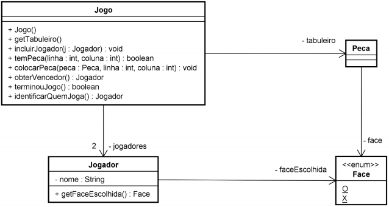

# Projeto Jogo da Velha - Programação 1

## Autores:
+ Henrique Gustavo Starosky
+ Victor Bona

Este documento descreve o trabalho da disciplina Programação I.
___
### Objetivos do Trabalho:
O trabalho consiste em construir um programa na linguagem Java para jogar o jogo da velha.
O programa deve possuir interface gráfica para interagir com o usuário. Deve utilizar a arquitetura em duas camadas
(camada de negócio e camada de apresentação).
O jogo deve possibilitar que uma ou duas pessoas joguem o jogo. O programa deve possibilitar que o usuário escolha
jogar com outra pessoa ou com o computador.
Para construir a solução, propõe-se como ponto de partida a implementação do diagrama abaixo na camada de negócio
(o diagrama está incompleto: métodos, parâmetros, adornos e tipos de retornos precisam ser especificados. Podem ser
acrescentadas outras classes).

|   | 
|:--:| 
| *Diagrama de Classes* |

 Na classe Jogo:
* O método getTabuleiro() foi recomendado para retornar o conteúdo do tabuleiro (indicando onde estão as
peças e em quais locais estão as peças).
* O método temPeca() avalia se há uma peça no tabuleiro, conforme coordenadas do tabuleiro informadas;
* O método colocarPeca() coloca uma peça no tabuleiro. Se já houver uma peça naquela posição, o método
deve lançar uma exceção
* O método obterVencedor() deve analisar se há algum ganhador, devolvendo a instância de jogador que
representa este jogador;
* O método terminouJogo() deve retornar true se o jogo foi finalizado e não há mais chances de ninguém jogar
qualquer peça;
* O método identificarQuemJoga() deve retornar qual jogador tem a vez de jogar.
___
### Método de Avaliação
É esperado que seja construído:
* (2,0 pt) Diagrama de classes detalhando todas as classes e relacionamentos, com código fonte compatível com o
diagrama. Todos os relacionamentos devem citar a multiplicidade. O diagrama de classes deve conter apenas as
classes da camada de negócios. Utilizar a linguagem UML para desenhar o diagrama. Recomenda-se utilizar o
software Astah UML, versão Student (ASTAH, 2018). O diagrama deve ser impresso e entregue no dia 23/11/2018,
durante a aula;
* (5,0 pts) Implementação do jogo funcional, atendendo a arquitetura em duas camadas. As classes da camada de
negócio devem ser devidamente documentadas com o estilo  javadoc ;
* (1,0 pt) Construção de um plano de testes para validar as classes da camada de negócios;
* (2,0 pt) Implementação do plano de testes através do framework JUnit. Todos os métodos públicos (que não são
getter e setter) devem possuir testes.

As classes do projeto devem ser organizadas em pacotes conforme a arquitetura de duas camadas. O projeto deve conter
apenas uma classe com o método  main() .

O trabalho pode ser feito em dupla e deverá ser submetido no AVA, na pasta “Trabalho” até 23/11/2018. Após esta data,
serão descontados 2 pontos para cada dia de atraso. O trabalho deve ser enviado somente por um dos membros da
equipe. Utilizar a anotação  @author  na classe que contém o método  main() , para informar os membros da equipe.
___
### Material a ser submetido no AVA
No AVA deverá ser submetido:
* O projeto contendo os arquivos fontes exportados pelo Netbeans (usar a opção Arquivo > Exportar Projeto > Para
Zip). Se utilizar bibliotecas de terceiros, também será necessário anexá-las ao projeto. Somente podem ser utilizadas
bibliotecas públicas;
* Uma versão compilada do projeto empacotada num arquivo .jar (HOW, 2017) deve ser enviada com o nome
“trabalho.jar”;
* O plano de testes;
* A implementação do plano de testes
___
### Biografia
ASTAH. Astah Community. Astah - Software Design Tools for Agile Teams. Disponivel em: <http://astah.net/editions/uml-new>. Acesso em: outubro 2018
HOW to Generate JAR File in Netbeans. Wikihow. Disponivel em: <http://www.wikihow.com/Generate-JAR-File-inNetbeans>. Acesso em: maio 2018.
